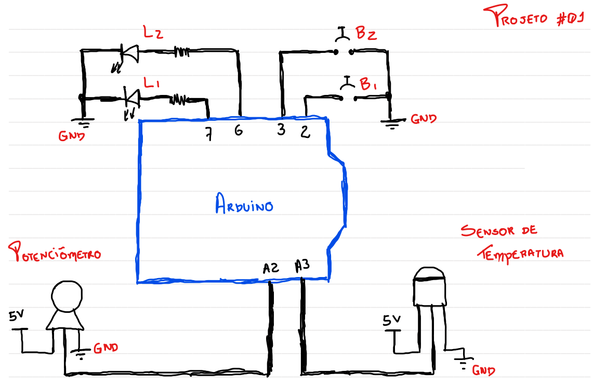

# Projeto 01: Sistema SCADA para monitoramento de tags na plataforma Arduino

## Visão Geral

Este projeto utiliza uma plataforma Arduino para fazer interface com dispositivos externos de forma a criar 6 tags, sendo duas analógicas e quatro digitais. O objetivo é criar um programa para a plataforma que permita obter os valores das tags e enviar estes valores para um sistema SCADA.
Esta integração pode ter vários desdobramentos no que diz respeito á supervisão das tags e a implementação de rede entre várias plataformas Arduino.

## Componentes Utilizados

- Arduino Uno
- Cabo USB
- Protoboard
- 2 push-button NA (2 terminais)
- 2 resistores 330R - 1/4 W
- 2 LEDs
- 1 potenciômetro 10k linear
- 1 sensor LM35

## Funcionalidades Principais

1. **Leitura de Dados:** O sensor de temperatura e umidade é utilizado para medir as condições ambientais.

2. **Exibição em Tempo Real:** Os dados são exibidos em um display LCD 16x2, proporcionando uma visualização instantânea das condições.

3. **Armazenamento de Dados:** Utilizando a memória EEPROM do Arduino, as leituras podem ser armazenadas para referência futura.

4. **Controle de Dispositivos Externos:** Opcionalmente, o sistema pode ser expandido para controlar dispositivos externos, como ventiladores ou aquecedores, baseando-se nas leituras.

## Esquema de Conexão



## Código Fonte (trecho)

```cpp
#include <DHT.h>
#include <LiquidCrystal_I2C.h>

#define DHTPIN 2
#define DHTTYPE DHT11

DHT dht(DHTPIN, DHTTYPE);
LiquidCrystal_I2C lcd(0x27, 16, 2);

void setup() {
  lcd.begin(16, 2);
  dht.begin();
}

void loop() {
  float umidade = dht.readHumidity();
  float temperatura = dht.readTemperature();

  lcd.clear();
  lcd.setCursor(0, 0);
  lcd.print("Temp: ");
  lcd.print(temperatura);
  lcd.print("C");

  lcd.setCursor(0, 1);
  lcd.print("Umidade: ");
  lcd.print(umidade);
  lcd.print("%");

  delay(2000);
}
